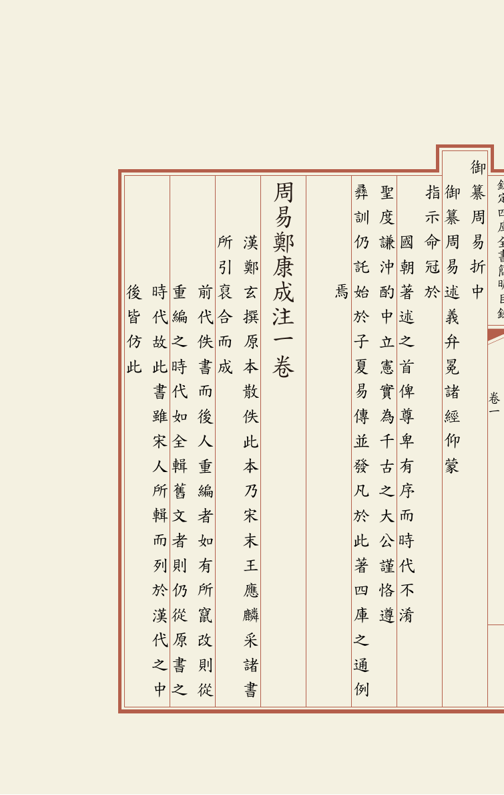
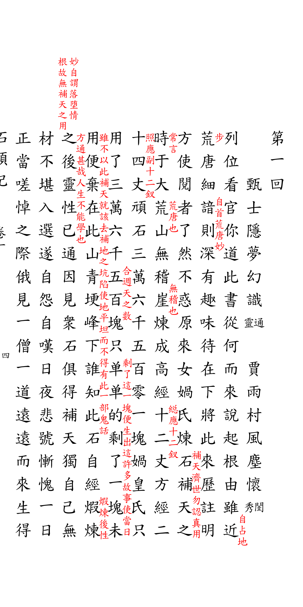
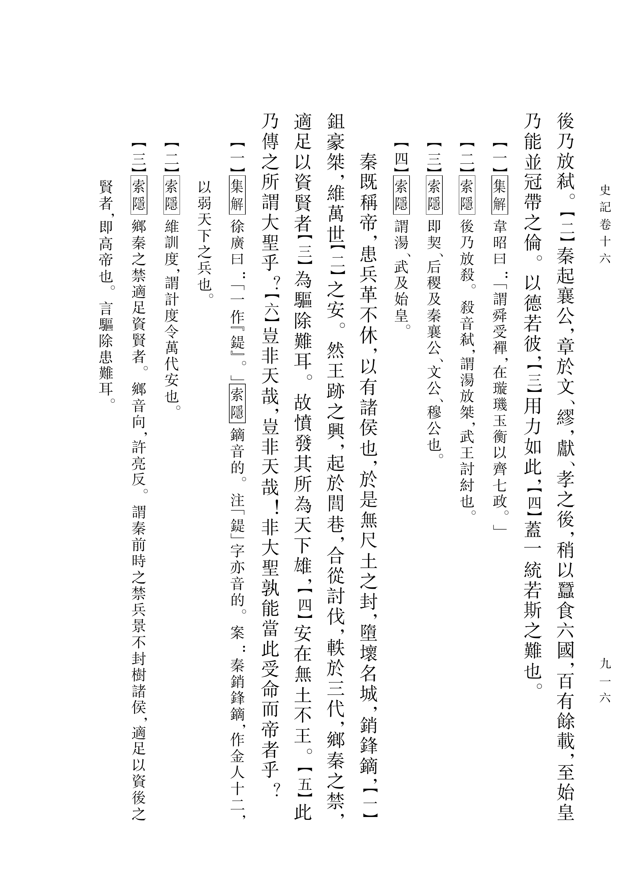
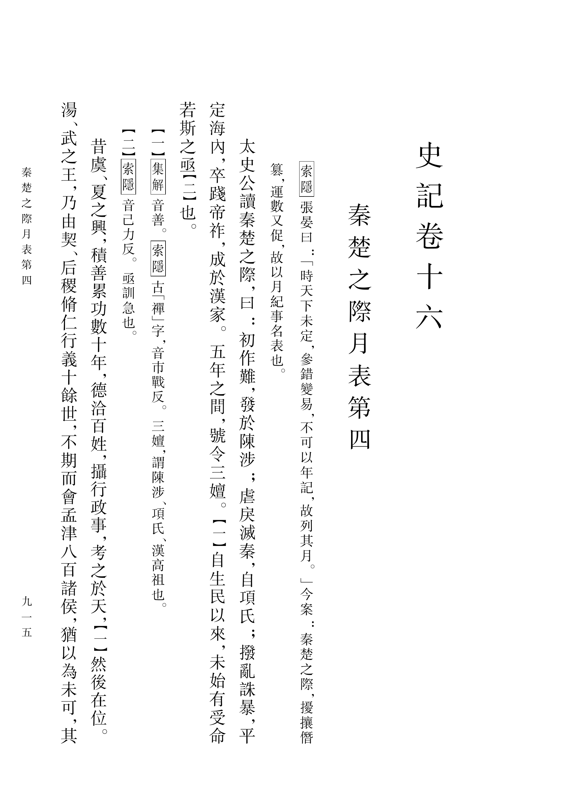

# LuaTeX-CN

[English Version](README-EN.md)

致力于基于 LuaTeX 引擎实现最纯粹、最高质量的中文排版支持。已完成对常见古籍版式的像素级复刻，能够直观地处理版心、夹注、侧批、眉批、脚注、印章、句读、改字、标点等等功能。同时支持现代繁体竖排，支持大陆与台湾不同标点标准。灵活支持用户自定义模板。

CTAN: [v0.3.0](https://ctan.org/pkg/luatex-cn) | GitHub Release: [v0.3.0](https://github.com/open-guji/luatex-cn/releases)

> **[Wiki 用户手册](https://github.com/open-guji/luatex-cn/wiki)** ｜ **[快速入门](https://github.com/open-guji/luatex-cn/wiki/Quick-Start)** ｜ **[命令索引](https://github.com/open-guji/luatex-cn/wiki/Command-Reference)** ｜ **[更新日志](https://github.com/open-guji/luatex-cn/wiki/Changelog)**

## 排版效果展示

### 古籍排版 - 四库全书·文渊阁本

| 《四库全书简明目录》 — 抬头、夹注、缩进 | 《史记·五帝本纪》 — 印章、夹注、乌丝栏 |
| :---: | :---: |
|  |  |
| [源码](示例/四库全书简明目录/目录.tex) ｜ [PDF](示例/四库全书简明目录/目录.pdf) | [源码](示例/史记五帝本纪/史记-黑白.tex) ｜ [PDF](示例/史记五帝本纪/史记-黑白.pdf) |

### 手抄本 -《红楼梦》甲戌本

| 第二页（标点） | 第一页（眉批） |
| :---: | :---: |
|  |  |

> [查看源码](示例/红楼梦甲戌本/石头记.tex) | [查看 PDF](示例/红楼梦甲戌本/石头记.pdf)

### 现代繁体竖排 -《史记·秦楚之际月表》

| 第二页 | 第一页 |
| :---: | :---: |
|  |  |

> [查看源码](示例/史记卷六·现代/卷十六.tex) | [查看 PDF](示例/史记卷六·现代/卷十六.pdf)

更多示例请查看 [示例目录](示例/README.md) 或 [Wiki 示例页](https://github.com/open-guji/luatex-cn/wiki/Examples)。

## 5 分钟快速开始

### 第一步：安装 TeX 发行版

如果你还没有安装 LaTeX 环境，需要先安装 **TeX Live**（推荐 2024 或更新版本）：

| 系统 | 安装方式 |
|------|---------|
| **Windows** | 下载 [TeX Live 安装包](https://tug.org/texlive/acquire-netinstall.html)，运行 `install-tl-windows.exe` |
| **macOS** | 下载 [MacTeX](https://tug.org/mactex/)，双击安装 |
| **Linux** | `sudo apt install texlive-full`（Ubuntu/Debian）或 `sudo dnf install texlive-scheme-full`（Fedora） |

> 详细指引请参阅 [Wiki 安装指南](https://github.com/open-guji/luatex-cn/wiki/Installation)。

### 第二步：安装 luatex-cn

推荐从 [GitHub Release](https://github.com/open-guji/luatex-cn/releases) 下载最新版本的 `luatex-cn-tex-v*.zip`，解压后将 `tex/` 下的内容放入：

```
~/texmf/tex/latex/luatex-cn/          (macOS/Linux)
C:\Users\<用户名>\texmf\tex\latex\luatex-cn\  (Windows)
```

然后运行 `texhash` 刷新。

也可以通过包管理器安装（CTAN 版本可能落后）：
```bash
tlmgr install luatex-cn
```

### 第三步：编译你的第一个古籍

创建 `test.tex`，写入以下内容：

```latex
\documentclass[四库全书]{ltc-guji}
\句读模式
%\setmainfont{TW-Kai}

\title{钦定四库全书}
\chapter{史记\\卷一}

\begin{document}
\begin{正文}
黄帝者，少典之子，姓公孫，名曰軒轅。\夹注{生而神靈，弱而能言，幼而徇齊，長而敦敏，成而聰明。}
\end{正文}
\end{document}
```

使用 **`lualatex`** 编译（注意不是 `pdflatex` 或 `xelatex`）：

```bash
lualatex test.tex
```

编译成功后打开 `test.pdf`，你将看到一个完整的古籍竖排页面。

> 接下来请查看 **[Wiki 快速入门](https://github.com/open-guji/luatex-cn/wiki/Quick-Start)** 了解更多命令用法，或浏览 **[命令索引](https://github.com/open-guji/luatex-cn/wiki/Command-Reference)** 查看全部命令。

## 功能特性

| 功能 | 说明 | Wiki 文档 |
|------|------|-----------|
| **竖排引擎** | 基于网格的高精度竖排文本流，支持自动分列分页 | [快速入门](https://github.com/open-guji/luatex-cn/wiki/Quick-Start) |
| **版心与鱼尾** | 单鱼尾/双鱼尾、乌丝栏、四周双边 | [模板](https://github.com/open-guji/luatex-cn/wiki/Templates) |
| **夹注** | 双栏小注自动平衡、跨列跨页 | [夹注](https://github.com/open-guji/luatex-cn/wiki/Side-Note) |
| **侧批/眉批** | 行间侧批、页面顶部眉批 | [批注](https://github.com/open-guji/luatex-cn/wiki/Annotation) |
| **句读** | 传统句读/现代标点/白文三种模式切换 | [句读](https://github.com/open-guji/luatex-cn/wiki/Judou) |
| **印章** | 电子印章绝对定位，支持透明度 | [印章](https://github.com/open-guji/luatex-cn/wiki/Seal) |
| **改字与装饰** | 古籍勘误、专名号、书名号、着重号 | [改字与装饰](https://github.com/open-guji/luatex-cn/wiki/Correction) |
| **抬头** | 单抬/双抬/三抬/平抬，自动边框包裹 | [抬头](https://github.com/open-guji/luatex-cn/wiki/Taitou) |
| **现代标点** | 标点挤压、禁则处理、大陆/台湾风格 | [标点系统](https://github.com/open-guji/luatex-cn/wiki/Punctuation) |
| **脚注** | 段末注/页下注，鹿角/带圈编号 | [脚注](https://github.com/open-guji/luatex-cn/wiki/ltc-book) |
| **模板系统** | 内置四库全书、红楼梦甲戌本、中华书局等预设 | [模板](https://github.com/open-guji/luatex-cn/wiki/Templates) |
| **字体管理** | 跨平台自动探测、字体族递补（Fallback） | [字体设置](https://github.com/open-guji/luatex-cn/wiki/Fonts) |
| **调试工具** | 网格可视化、坐标标尺、模块级日志 | [调试模式](https://github.com/open-guji/luatex-cn/wiki/Debug) |

## 三个文档类

| 文档类 | 用途 | 示例 |
|--------|------|------|
| **`ltc-guji`** | 传统古籍排版（版心、鱼尾、丝栏） | `\documentclass{ltc-guji}` |
| **`ltc-cn-vbook`** | 现代大陆竖排书籍 | `\documentclass{ltc-cn-vbook}` |
| **`ltc-tw-vbook`** | 现代台湾竖排书籍 | `\documentclass{ltc-tw-vbook}` |

> 所有命令都支持简体、繁体中文名称。例如 `\夹注{...}`、`\侧批{...}`、`\begin{正文}`。

## 模板

除了默认模板，luatex-cn 支持自定义模板。欢迎贡献新的模板！请将模板文件放在 [模板目录](模板/) 并提交 Pull Request。推荐模板：

| 模板 | 说明 | 源码 |
|------|------|------|
| **四库全书文渊阁本** | 八行二十一字，正文首页带"文渊阁宝"印章，目录封面黄底，页面淡黄背景 | [cfg](模板/四库全书文渊阁本.cfg) |

在文档中使用模板：
```latex
\documentclass[四库全书文渊阁本]{ltc-guji}
\begin{document}
  ...
\end{document}
```

。

## 系统要求

- LuaTeX（推荐 TeX Live 2024+）
- `luaotfload` 和 `fontspec`（TeX Live 自带）
- 中文字体（系统通常已自带，推荐思源宋体或楷体以获得最佳古籍效果）

## 路线图

- **已完成**：古籍竖排，版心，夹注，侧批，眉批，脚注，印章，句读，改字，现代标点系统，模板系统等
- **v0.2.x**：完善现代繁体竖排，完整排版更多古籍
- **v0.3.0**：完善文档体系，支持简繁命令，准备更大范围推广

## 文档与社区

- **[Wiki 用户手册](https://github.com/open-guji/luatex-cn/wiki)** — 完整的使用指南
- **[命令索引](https://github.com/open-guji/luatex-cn/wiki/Command-Reference)** — 全部命令的参数速查
- **[示例](示例/README.md)** — 查看完整的排版源码
- **[Issue](https://github.com/open-guji/luatex-cn/issues)** — 报告 Bug 或提出建议

联系人: Sheldon Li | 邮件: sheldonli.dev@gmail.com

## 开发与测试

如果你希望参与开发或在本地测试源码更改，请参考 [开发者指南](文档/developer_guide.md) 或 [Wiki 开发文档](https://github.com/open-guji/luatex-cn/wiki/Development)。

## 许可证

Apache License 2.0
