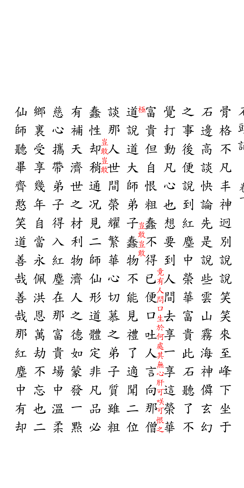
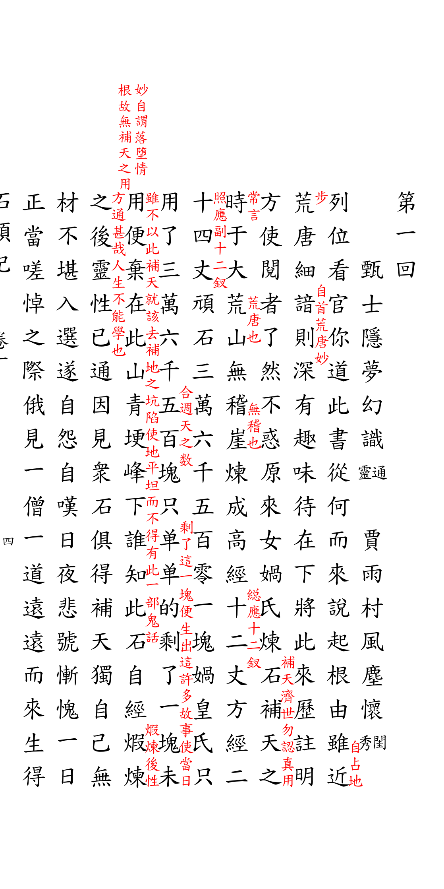

# LuaTeX-CN

[English Version](README-EN.md)

致力于基于 LuaTeX 引擎实现最纯粹、最高质量的中文排版支持.长期愿景希望完整支持中文排版，包括横排/竖排，古籍/现代版式。目前主要实现古籍复刻，已完整覆盖竖排核心逻辑、版心装饰及夹注处理。

LuaTeX package for Chinese charactor typesetting, covering horizontal/vertical, tranditional/mordern layout. Currently focus on Ancient Book replication. Implemented core logic of vertical typesetting, decorative elements of traditional Chinese books, and interlinear notes.

CTAN （审核中/Under Review）: [v0.1.1](https://ctan.org/pkg/luatex-cn)

GitHub Release: [v0.1.1](https://github.com/open-guji/luatex-cn/releases)

## 展示

### 1. 《史记·五帝本纪》 (四库全书排版)
演示了复杂的加注、单鱼尾版心以及馆藏印章的绝对定位。

| 黑白仿真 | 彩色预览 |
| :---: | :---: |
|  |  |

> [查看源码](示例/史记五帝本纪/史记.tex) | [查看 PDF](示例/史记五帝本纪/史记.pdf)

### 2. 《红楼梦》（甲戌本排版） 
演示了侧批、眉批、手抄本版式。

| 第二页 | 第一页 |
| :---: | :---: |
|  |  |

> [查看源码](示例/红楼梦甲戌本/石头记.tex) | [查看 PDF](示例/红楼梦甲戌本/石头记.pdf)

## 功能特性

- **竖排排版（竖排）**：经典竖排布局的强大核心引擎
- **古籍版式（古籍版式）**：完整支持"版心"、"鱼尾"和边框
- **夹注（夹注）**：双栏小注的自动平衡和分段
- **批注（批注）**：支持在页面任意位置浮动定位的批注框
- **基于网格的定位**：通过 Lua 计算布局精确控制字符位置，无限扩展性

## 安装

详细安装说明请参阅 [INSTALL.md](INSTALL.md)。

快速安装：
1. **即将发布至 CTAN**，你可以直接使用 TeX 发行版自带的包管理器进行安装：
2. 从 [GitHub Release](https://github.com/open-guji/luatex-cn/releases) 下载最新版本的 `luatex-cn-src-v*.zip`。解压到 `texmf/tex/latex/luatex-cn/`，运行 `texhash`。
3. 下载最新版本，解压到自己正在编写的.tex文件夹中，直接编译。

## 使用方法

推荐通过 `ltc-guji` 文档类使用本宏包：

```latex
\documentclass[四库全书]{ltc-guji}
% 如果不指定字体，会使用系统默认中文字体
% \setmainfont{Noto Serif SC}

\begin{document}
\begin{正文}
\chapter{五帝本紀第一}
這是竖排的中文文本示例，包含夹注\夹注{双行小注}的功能演示。

\begin{列表}
    \item 史部
    \item 卷一
\end{列表}

% \印章[page=1]{seal.png}
\end{正文}
\end{document}
```

## 系统要求

- LuaTeX (推荐 TeX Live 2024+)
- `luaotfload` 和 `fontspec`
- 选择非系统自带的中文字体需安装（例如 Noto Serif SC、 TW-Kai）

## 文档

[用户文档](文档/README.md) | [示例用法](示例/README.md)

联系人(contract): Sheldon Li

邮件（Email）: sheldonli.dev@gmail.com

## 许可证

Apache License 2.0
