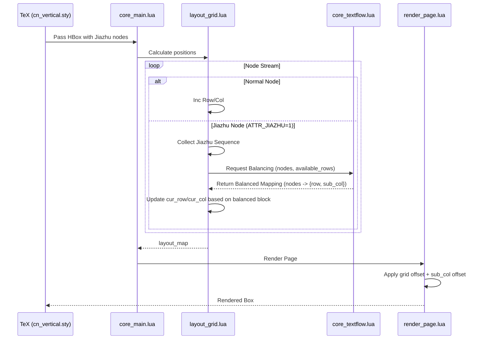

# TextFlow (Jiazhu) Technical Design Document

## 1. Overview

This document outlines the technical architecture for the `TextFlow` system, specifically designed to implement the **Jiazhu (夹注)** feature in Chinese vertical typesetting. Unlike the existing `GridTextbox`, which has a fixed height, `TextFlow` allows high-precision dual-column interlinear notes to flow across multiple columns and pages.

## 2. Three-Layer Implementation Strategy

We follow the project's existing three-layer architecture to implement this feature.

### 2.1 Layer 1: LaTeX Interface (TeX Layer)
*   **File**: `cn_vertical.sty`
*   **Mechanism**: Define a command `\jiazhu{...}`.
*   **Responsibilities**:
    *   Set the font size to 50% of the parent text.
    *   Set a LuaTeX attribute `ATTR_JIAZHU = 1` on all glyphs and nodes within the note.
    *   Ensure the baseline and grid alignment markers are preserved.

### 2.2 Layer 2: Core Logic Layer (Coordination Layer)
*   **New File**: `core_textflow.lua`
*   **Responsibilities**:
    *   **Balancing Algorithm**: Given a list of nodes and a capacity $N$, split them into a "Right Sub-column" and a "Left Sub-column".
    *   **Capacity Calculation**: Determine how many characters can fit in the remaining space of a column (Capacity $= \text{Remaining Rows} \times 2$).
    *   **Attribute Assignment**: Assign `ATTR_JIAZHU_SUB = 1` (Right) or `2` (Left) to nodes based on the split.

### 2.3 Layer 3: Layout & Rendering Layer (Processing Layer)
*   **Layout Modification** (`layout_grid.lua`):
    *   When the layout engine encounters a node with `ATTR_JIAZHU = 1`, it pauses normal grid placement.
    *   It peeks ahead to collect all continuous Jiazhu nodes.
    *   It calculates the flow across the current column and subsequent columns.
    *   It places nodes from both sub-columns into the same grid row index but records their sub-column status in the `layout_map`.
*   **Rendering Modification** (`render_position.lua`):
    *   `calc_grid_position` will be updated to accept a `sub_col` parameter.
    *   **Sub-column 1 (Right)**: Aligns to the right half of the grid cell (H-Align: Right).
    *   **Sub-column 2 (Left)**: Aligns to the left half of the grid cell (H-Align: Left).

## 3. Key Algorithms and Logic

### 3.1 The "Balanced Flow" Algorithm
For a Jiazhu block of length $L$:

1.  **Current Column Check**:
    *   Available Rows $H = \text{line\_limit} - \text{cur\_row}$.
    *   Node Capacity $C = H \times 2$.
    *   Nodes to take $N = \min(L, C)$.
2.  **Balancing $N$ nodes**:
    *   Right count $R = \lceil N/2 \rceil$.
    *   Left count $L\_count = N - R$.
    *   Nodes $1 \dots R$ go to the Right sub-column.
    *   Nodes $R+1 \dots N$ go to the Left sub-column.
3.  **Coordinate Assignment**:
    *   Pair nodes: `Node[i]` and `Node[R+i]` are placed in `cur_row + i - 1`.
4.  **Iteration**: If $L > C$, the remaining nodes are processed in the next column starting from `row = 0`.

### 3.2 Orphan Control (孤行控制)
To prevent a Jiazhu block from starting on the very last row of a column without its balanced partner:
*   If `available_rows < 1`, force a column break before starting the Jiazhu.
*   The system must ensure that at least one pair (or one partial pair) is placed together.

## 4. Data Structures

### 4.1 Attributes
*   `ATTR_JIAZHU` (Flag): `1` for Jiazhu content, `0` otherwise.
*   `ATTR_JIAZHU_SUB` (Sub-column): `1` for Right, `2` for Left. (Assigned during layout).

### 4.2 Layout Map Expansion
The `layout_map` entry for a node will now include:
```lua
layout_map[node] = {
    page = ...,
    col = ...,
    row = ...,
    sub_col = 1 or 2,  -- New field
    ...
}
```

## 5. File Changes Summary

| File | Change | Nature |
|------|--------|--------|
| `base_constants.lua` | Define `ATTR_JIAZHU` and `ATTR_JIAZHU_SUB`. | Constants |
| `cn_vertical.sty` | Implement `\jiazhu` command and attribute setup. | LaTeX |
| `core_textflow.lua` | [**NEW**] Balancing and chunking logic. | Logic |
| `layout_grid.lua` | Integrate Jiazhu collector and flow logic. | Layout |
| `render_position.lua` | Update `calc_grid_position` for sub-column offsets. | Rendering |

## 6. Mermaid Sequence Diagram

