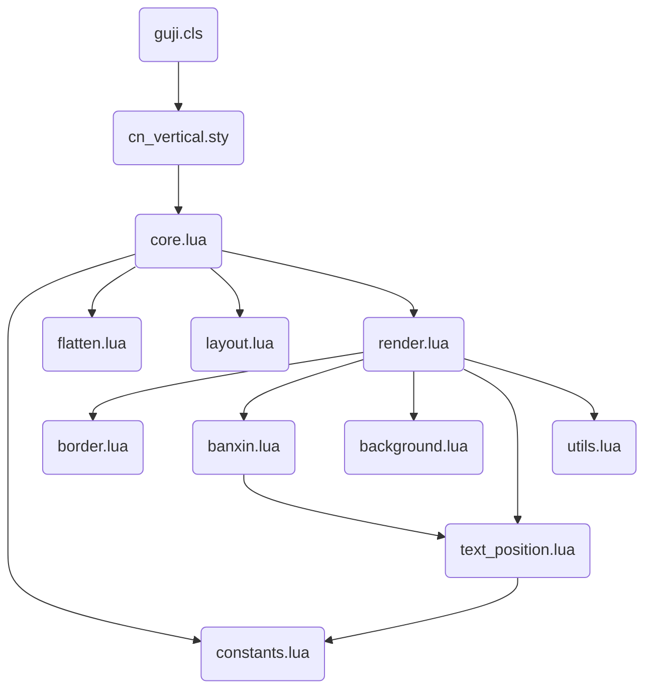

# cn_vertical - 中文竖排排版引擎 (LuaTeX)

这是一个为 LuaTeX 设计的中文竖排排版系统，采用**基于网格的坐标映射**方案。它不依赖于传统的 TeX 行拆分逻辑，而是通过 Lua 接管节点的几何排布，实现精准、灵活的传统古籍排版（如 RTL 顺序、版心、鱼尾等）。

## 核心组件及其作用

该系统被划分为 LaTeX 接口层、Lua 协调层和三个主要的流水线阶段：

### 1. LaTeX 与 模板接口
*   **[cn_vertical.sty](file:///c:/Users/lisdp/workspace/luatex-cn/cn_vertical/cn_vertical.sty)**: 核心宏包。定义了 TeX 属性（attributes）、键值配置接口（using `expl3`）以及主要的排版命令 `\VerticalRTT`（用于流式文本）和 `\GridTextbox`（用于固定尺寸网格块）。
*   **[guji.cls](file:///c:/Users/lisdp/workspace/luatex-cn/cn_vertical/guji.cls)**: 专为古籍设计的文档类。封装了 `cn_vertical`，并提供了 `guji-content` 环境，内置了根据纸张几何尺寸自动计算网格行数的逻辑。
*   **[sikuquanshu.guji](file:///c:/Users/lisdp/workspace/luatex-cn/cn_vertical/sikuquanshu.guji)**: 模板文件，预设了《四库全书》风格的标准几何参数、边框样式及颜色方案。

### 2. Lua 控制与协作层
*   **[core.lua](file:///c:/Users/lisdp/workspace/luatex-cn/cn_vertical/core.lua)**: 系统总入口。协调各个子模块，处理 TeX 的盒子数据，并实现多页渲染循环。
*   **[constants.lua](file:///c:/Users/lisdp/workspace/luatex-cn/cn_vertical/constants.lua)**: 定义了全局共享的节点类型 ID、属性索引及尺寸转换等基础工具。
*   **[utils.lua](file:///c:/Users/lisdp/workspace/luatex-cn/cn_vertical/utils.lua)**: 提供通用的辅助函数，如 PDF 颜色格式归一化。

### 3. 三阶段排版流水线
1.  **[flatten.lua](file:///c:/Users/lisdp/workspace/luatex-cn/cn_vertical/flatten.lua) (展平与检测)**: 
    *   **作用**: 将 TeX 复杂的嵌套盒子结构递归展开为一维节点流。
    *   **重要功能**: 自动检测 `leftskip`、`shift` 等缩进信息，并将其转化为属性附加到节点上，使得 `itemize` 等标准环境能自动继承缩进。
2.  **[layout.lua](file:///c:/Users/lisdp/workspace/luatex-cn/cn_vertical/layout.lua) (网格布局模拟)**: 
    *   **作用**: 进行虚拟布局计算。确定每个节点应该在哪一页、哪一列、第几行。
    *   *功能*: 处理自动换列、分页、避让版心位置。支持 "distribute" 模式（在垂直方向均匀分布字符）。
3.  **[render.lua](file:///c:/Users/lisdp/workspace/luatex-cn/cn_vertical/render.lua) (渲染与绘制)**: 
    *   **作用**: 将计算出的几何坐标应用到节点上。
    *   **重要功能**: 对文字节点（Glyph）使用 `xoffset`/`yoffset` 进行移位；对块级网格（Block）使用 Kern/Shift 组合定位。同时触发背景、边框及版心的绘制。

### 4. 视觉元素绘制模块
*   **[text_position.lua](file:///c:/Users/lisdp/workspace/luatex-cn/cn_vertical/text_position.lua)**: 复用的文字定位工具，处理字符在该网格单元内的居中及垂直堆叠逻辑。
*   **[banxin.lua](file:///c:/Users/lisdp/workspace/luatex-cn/cn_vertical/banxin.lua)**: 专门负责“版心”（鱼尾）区域的绘制，包括横向分隔线和特定的竖排文字。
*   **[border.lua](file:///c:/Users/lisdp/workspace/luatex-cn/cn_vertical/border.lua)**: 负责绘制列边框和内外套叠的双重外边框。
*   **[background.lua](file:///c:/Users/lisdp/workspace/luatex-cn/cn_vertical/background.lua)**: 负责页面背景色填充和全文字体颜色设置。

---

## 模块依赖关系 (Mermaid)

---

## 关键设计决定 (Design Decisions)

1.  **虚拟网格系统 (Virtual Grid)**: 
    不依赖传统的基线对齐，而是将页面划分为抽象的单元格。这种方案能够解决传统 TeX 在多列竖排时难以精确控制行高的痛点。
2.  **属性驱动逻辑 (Attribute-Driven)**: 
    TeX 只负责生成节点流并附带属性标记（如 `cnverticalindent`），而复杂的几何运算全部交给 Lua。这实现了 LaTeX 的易用性与 Lua 的强控制能力的解耦。
3.  **三阶段流水线设计**: 
    将“数据提取、位置模拟、实际着色”分为三个独立步骤。这种模块化设计使得添加新功能（如支持脚注或更复杂的图文绕排）变得更加清晰。
4.  **底层 PDF 直绘**: 
    边框、版心线和背景色通过 `pdf_literal` 直接写入 PDF 指令（`re`, `m`, `l`, `S`, `f`），而非使用 TeX 的 Rule。这保证了在极细线宽和复杂重叠场景下的最佳性能和渲染精度。
5.  **统一文字定位 (Unified Positioning)**: 
    Banxin 中的文字与主文本文字共用一套 `text_position.lua` 逻辑，确保了全书字符在网格中的对齐一致性（包括偏置处理和负 Kern 抵消）。
