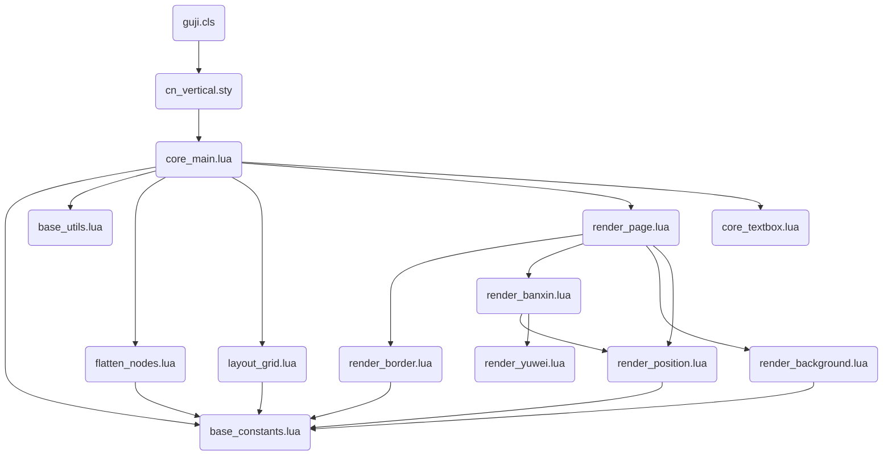

# cn_vertical - 中文竖排排版引擎 (LuaTeX)

这是一个为 LuaTeX 设计的中文竖排排版系统，采用**基于网格的坐标映射**方案。它不依赖于传统的 TeX 行拆分逻辑，而是通过 Lua 接管节点的几何排布，实现精准、灵活的传统古籍排版（如 RTL 顺序、版心、鱼尾等）。

---

## 文件结构与层级划分

本系统采用三层架构设计，文件名前缀清晰标识其所属层级：

### 基础层 (Base Layer) - `base_` 前缀
| 文件名 | 说明 |
|--------|------|
| `base_constants.lua` | 全局常量、节点类型 ID、属性索引、尺寸转换函数 |
| `base_utils.lua` | 通用工具函数（颜色归一化、调试日志、调试矩形绘制） |

### 协调层 (Core Layer) - `core_` 前缀
| 文件名 | 说明 |
|--------|------|
| `core_main.lua` | 系统总入口，协调三阶段流水线，管理多页渲染 |
| `core_textbox.lua` | 文本框（GridTextbox）处理，将 TeX 盒子转为竖排网格块 |

### 第一阶段 - 展平层 (Flatten Layer) - `flatten_` 前缀
| 文件名 | 说明 |
|--------|------|
| `flatten_nodes.lua` | 将嵌套盒子展平为一维节点流，提取缩进信息 |

### 第二阶段 - 布局层 (Layout Layer) - `layout_` 前缀
| 文件名 | 说明 |
|--------|------|
| `layout_grid.lua` | 虚拟网格布局计算，确定每个节点的页/列/行位置 |

### 第三阶段 - 渲染层 (Render Layer) - `render_` 前缀
| 文件名 | 说明 |
|--------|------|
| `render_page.lua` | 坐标应用主模块，调用各渲染子模块 |
| `render_position.lua` | 文字定位计算，处理字符居中和对齐 |
| `render_banxin.lua` | 版心（鱼尾）绘制，含分隔线和竖排文字 |
| `render_border.lua` | 列边框和外边框绘制 |
| `render_background.lua` | 背景色和字体颜色设置 |
| `render_yuwei.lua` | 鱼尾装饰符号绘制（实心/空心，上/下方向） |

### LaTeX 接口层
| 文件名 | 说明 |
|--------|------|
| `cn_vertical.sty` | 核心宏包，定义 TeX 属性和排版命令 |
| `guji.cls` | 古籍文档类，封装 cn_vertical 并提供便捷接口 |
| `sikuquanshu.guji` | 四库全书风格模板，预设几何参数和颜色方案 |

---

## 三阶段排版流水线

```
TeX 层 (cn_vertical.sty)
   ↓ 调用 process_from_tex(box_num, params)
core_main.lua (协调层)
   ↓ 调用 prepare_grid()
┌────────────────────────────────────┐
│  Stage 1: flatten_nodes.lua       │ ← 展平嵌套盒子，提取缩进
├────────────────────────────────────┤
│  Stage 2: layout_grid.lua         │ ← 虚拟布局，计算每个节点的页/列/行
├────────────────────────────────────┤
│  Stage 3: render_page.lua         │ ← 应用坐标，绘制边框/背景/版心
│           ├─ render_border.lua    │
│           ├─ render_banxin.lua    │
│           ├─ render_background.lua│
│           └─ render_position.lua  │
└────────────────────────────────────┘
   ↓ 返回渲染好的页面列表
load_page() → TeX 输出到 PDF
```

---

## 模块依赖关系 (Mermaid)



---

## 术语对照表 (Terminology)

| 英文术语 | 中文解释 |
|----------|----------|
| scaled points (sp) | TeX 内部单位，1pt = 65536sp |
| big points (bp) | PDF 单位，1bp ≈ 1/72 inch |
| glyph | 字形节点 |
| kern | 字距调整节点 |
| hlist / vlist | 水平列表 / 垂直列表 |
| glue | 胶水/弹性空白 |
| penalty | 惩罚值（控制换行/分页） |
| flatten | 展平（将嵌套结构转为线性结构） |
| layout_map | 布局映射（节点指针 → 坐标位置） |
| banxin | 版心（古籍中间的分隔列） |
| yuwei | 鱼尾（版心中的装饰符号） |
| RTL | 从右到左（Right-To-Left） |
| xoffset / yoffset | 字形偏移（glyph 专用定位属性） |
| pdf_literal | PDF 直写节点 |
| rg / RG | PDF 填充色/描边色指令 |

---

## 常见问题排查：文字消失 (Missing Text)

如果修改代码后发现生成的 PDF 中文字消失，通常由以下原因引起：

### 1. 错误的 PDF Literal 指令（最常见）
*   **现象**：整页内容消失，或者从某个点开始所有内容消失。
*   **原因**：插入了非法的 PDF 语法。例如颜色指令必须是 `0 0 0 rg`，如果传入 `black rg`，PDF 渲染器会崩溃。
*   **对策**：确保所有颜色通过 `base_utils.normalize_rgb` 处理。检查 `pdf_literal` 中的 `q` (save) 和 `Q` (restore) 是否成对出现。

### 2. 坐标计算超出范围
*   **现象**：文字存在于节点流中（日志可见），但 PDF 视角看不到。
*   **原因**：`xoffset` 或 `yoffset` 的计算值使文字掉到了页面之外（例如负值或极大值）。
*   **对策**：开启全局显示模式 `\GujiDebugOn`。如果开启后能看到蓝色/红色辅助框但看不到文字，说明是坐标偏移问题。

### 3. 被背景色遮挡（层级问题）
*   **现象**：背景色正常显示，但文字被覆盖。
*   **原因**：背景矩形在文字节点之后插入，由于 PDF 的"画家模型"，后画的内容会覆盖先画的内容。
*   **对策**：检查 `render_page.lua` 中的绘制顺序，确保 `draw_background` 使用 `insert_before` 插入到链表的头部。

### 4. 字体缺失
*   **现象**：日志显示 `Missing character: There is no ... in font ...`。
*   **原因**：使用了不支持中文的 LaTeX 类（如 `article`）且未配置 `fontspec`，或者指定的字体文件不存在。
*   **对策**：始终使用 `\documentclass{guji}`。

---

## 关键设计决定 (Design Decisions)

1.  **虚拟网格系统 (Virtual Grid)**:
    不依赖传统的基线对齐，而是将页面划分为抽象的单元格。这种方案能够解决传统 TeX 在多列竖排时难以精确控制行高的痛点。

2.  **属性驱动逻辑 (Attribute-Driven)**:
    TeX 只负责生成节点流并附带属性标记（如 `cnverticalindent`），而复杂的几何运算全部交给 Lua。这实现了 LaTeX 的易用性与 Lua 的强控制能力的解耦。

3.  **三阶段流水线设计**:
    将"数据提取、位置模拟、实际着色"分为三个独立步骤。这种模块化设计使得添加新功能（如支持脚注或更复杂的图文绕排）变得更加清晰。

4.  **底层 PDF 直绘**:
    边框、版心线和背景色通过 `pdf_literal` 直接写入 PDF 指令（`re`, `m`, `l`, `S`, `f`），而非使用 TeX 的 Rule。这保证了在极细线宽和复杂重叠场景下的最佳性能和渲染精度。

5.  **统一文字定位 (Unified Positioning)**:
    Banxin 中的文字与主文本文字共用一套 `render_position.lua` 逻辑，确保了全书字符在网格中的对齐一致性（包括偏置处理和负 Kern 抵消）。

6.  **文件命名规范 (File Naming Convention)**:
    所有 Lua 文件使用前缀标识其所属层级（`base_`、`core_`、`flatten_`、`layout_`、`render_`），便于快速理解模块职责和依赖关系。

---

## 常见问题排查：动态字体缩放后字形尺寸获取失败

### 问题现象
当使用 `font_scale` 参数缩放字体时，字形的水平对齐（如 `h_align="right"`）出现严重偏移，文字超出预期边界。

### 根本原因
在 LuaTeX 中，使用 `font.define()` 动态定义新字体后，`font.getfont(new_font_id)` 会返回 `nil`。这是因为 `font.define()` 返回的是一个新的字体 ID，但该字体的元数据并未被 LuaTeX 内部缓存。

### 解决方案
在调用 `font.define()` 之前，保存原始字体数据的引用，后续从原始数据获取字符尺寸，再乘以 `font_scale_factor`：

```lua
local base_font_data = font.getfont(font_id)  -- 在缩放前保存
local font_scale_factor = params.font_scale or 1.0

-- 获取字形尺寸时使用 base_font_data
if base_font_data and base_font_data.characters and base_font_data.characters[cp] then
    gw = base_font_data.characters[cp].width * font_scale_factor
end
```

---

## 版本历史

- **v0.4.0 (2026-01-13)**: 文件重命名，添加层级前缀，完善中文注释和术语对照
- **v0.3.0 (2026-01-12)**: 模块化重构，拆分为三阶段流水线
- **v0.2.0**: 添加版心、鱼尾支持
- **v0.1.0**: 初始版本，基础竖排功能
