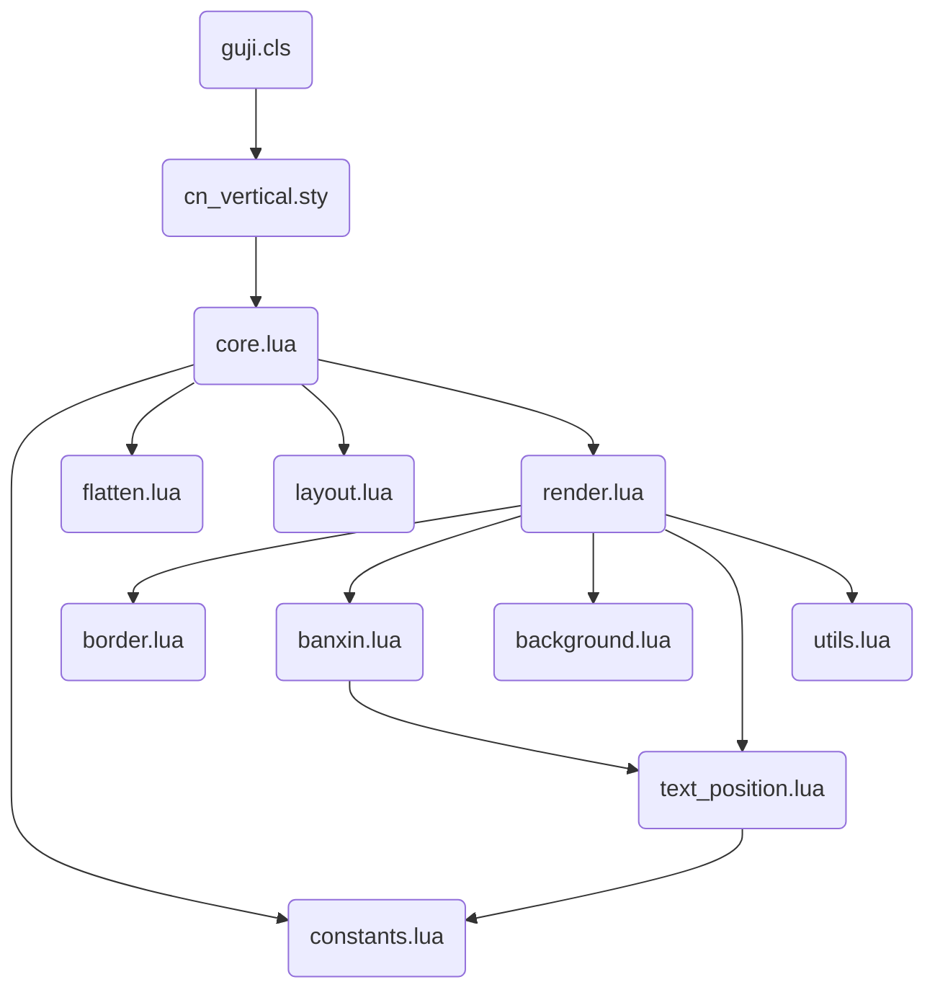

# cn_vertical - 中文竖排排版引擎 (LuaTeX)

这是一个为 LuaTeX 设计的中文竖排排版系统，采用**基于网格的坐标映射**方案。它不依赖于传统的 TeX 行拆分逻辑，而是通过 Lua 接管节点的几何排布，实现精准、灵活的传统古籍排版（如 RTL 顺序、版心、鱼尾等）。

## 核心组件及其作用

该系统被划分为 LaTeX 接口层、Lua 协调层和三个主要的流水线阶段：

### 1. LaTeX 与 模板接口
*   **[cn_vertical.sty](file:///c:/Users/lisdp/workspace/luatex-cn/cn_vertical/cn_vertical.sty)**: 核心宏包。定义了 TeX 属性（attributes）、键值配置接口（using `expl3`）以及主要的排版命令 `\VerticalRTT`（用于流式文本）和 `\GridTextbox`（用于固定尺寸网格块）。
*   **[guji.cls](file:///c:/Users/lisdp/workspace/luatex-cn/cn_vertical/guji.cls)**: 专为古籍设计的文档类。封装了 `cn_vertical`，并提供了 `guji-content` 环境，内置了根据纸张几何尺寸自动计算网格行数的逻辑。
*   **[sikuquanshu.guji](file:///c:/Users/lisdp/workspace/luatex-cn/cn_vertical/sikuquanshu.guji)**: 模板文件，预设了《四库全书》风格的标准几何参数、边框样式及颜色方案。

### 2. Lua 控制与协作层
*   **[core.lua](file:///c:/Users/lisdp/workspace/luatex-cn/cn_vertical/core.lua)**: 系统总入口。协调各个子模块，处理 TeX 的盒子数据，并实现多页渲染循环。
*   **[constants.lua](file:///c:/Users/lisdp/workspace/luatex-cn/cn_vertical/constants.lua)**: 定义了全局共享的节点类型 ID、属性索引及尺寸转换等基础工具。
*   **[utils.lua](file:///c:/Users/lisdp/workspace/luatex-cn/cn_vertical/utils.lua)**: 提供通用的辅助函数，如 PDF 颜色格式归一化。

### 3. 三阶段排版流水线
1.  **[flatten.lua](file:///c:/Users/lisdp/workspace/luatex-cn/cn_vertical/flatten.lua) (展平与检测)**: 
    *   **作用**: 将 TeX 复杂的嵌套盒子结构递归展开为一维节点流。
    *   **重要功能**: 自动检测 `leftskip`、`shift` 等缩进信息，并将其转化为属性附加到节点上，使得 `itemize` 等标准环境能自动继承缩进。
2.  **[layout.lua](file:///c:/Users/lisdp/workspace/luatex-cn/cn_vertical/layout.lua) (网格布局模拟)**: 
    *   **作用**: 进行虚拟布局计算。确定每个节点应该在哪一页、哪一列、第几行。
    *   *功能*: 处理自动换列、分页、避让版心位置。支持 "distribute" 模式（在垂直方向均匀分布字符）。
3.  **[render.lua](file:///c:/Users/lisdp/workspace/luatex-cn/cn_vertical/render.lua) (渲染与绘制)**: 
    *   **作用**: 将计算出的几何坐标应用到节点上。
    *   **重要功能**: 对文字节点（Glyph）使用 `xoffset`/`yoffset` 进行移位；对块级网格（Block）使用 Kern/Shift 组合定位。同时触发背景、边框及版心的绘制。

## 常见问题排查：文字消失 (Missing Text)

如果修改代码后发现生成的 PDF 中文字消失，通常由以下三个原因引起：

### 1. 错误的 PDF Literal 指令（最常见）
*   **现象**：整页内容消失，或者从某个点开始所有内容消失。
*   **原因**：插入了非法的 PDF 语法。例如颜色指令必须是 `0 0 0 rg`，如果传入 `black rg`，PDF 渲染器会崩溃。
*   **对策**：确保所有颜色通过 `utils.normalize_rgb` 处理。检查 `pdf_literal` 中的 `q` (save) 和 `Q` (restore) 是否成对出现。

### 2. 坐标计算超出范围
*   **现象**：文字存在于节点流中（日志可见），但 PDF 视角看不到。
*   **原因**：`xoffset` 或 `yoffset` 的计算值使文字掉到了页面之外（例如负值或极大值）。
*   **对策**：开启全局显示模式 `\GujiDebugOn`。如果开启后能看到蓝色/红色辅助框但看不到文字，说明是坐标偏移问题。

### 3. 被背景色遮挡（层级问题）
*   **现象**：背景色正常显示，但文字被覆盖。
*   **原因**：背景矩形在文字节点之后插入，由于 PDF 的"画家模型"，后画的内容会覆盖先画的内容。
*   **对策**：检查 `render.lua` 中的绘制顺序，确保 `draw_background` 使用 `insert_before` 插入到链表的头部。

### 4. 字体缺失
*   **现象**：日志显示 `Missing character: There is no ... in font ...`。
*   **原因**：使用了不支持中文的 LaTeX 类（如 `article`）且未配置 `fontspec`，或者指定的字体文件不存在。
*   **对策**：始终使用 `\documentclass{guji}`。
### 4. 视觉元素绘制模块
*   **[text_position.lua](file:///c:/Users/lisdp/workspace/luatex-cn/cn_vertical/text_position.lua)**: 复用的文字定位工具，处理字符在该网格单元内的居中及垂直堆叠逻辑。
*   **[banxin.lua](file:///c:/Users/lisdp/workspace/luatex-cn/cn_vertical/banxin.lua)**: 专门负责“版心”（鱼尾）区域的绘制，包括横向分隔线和特定的竖排文字。
*   **[border.lua](file:///c:/Users/lisdp/workspace/luatex-cn/cn_vertical/border.lua)**: 负责绘制列边框和内外套叠的双重外边框。
*   **[background.lua](file:///c:/Users/lisdp/workspace/luatex-cn/cn_vertical/background.lua)**: 负责页面背景色填充和全文字体颜色设置。

---

## 模块依赖关系 (Mermaid)



---

## 关键设计决定 (Design Decisions)

1.  **虚拟网格系统 (Virtual Grid)**: 
    不依赖传统的基线对齐，而是将页面划分为抽象的单元格。这种方案能够解决传统 TeX 在多列竖排时难以精确控制行高的痛点。
2.  **属性驱动逻辑 (Attribute-Driven)**: 
    TeX 只负责生成节点流并附带属性标记（如 `cnverticalindent`），而复杂的几何运算全部交给 Lua。这实现了 LaTeX 的易用性与 Lua 的强控制能力的解耦。
3.  **三阶段流水线设计**: 
    将“数据提取、位置模拟、实际着色”分为三个独立步骤。这种模块化设计使得添加新功能（如支持脚注或更复杂的图文绕排）变得更加清晰。
4.  **底层 PDF 直绘**: 
    边框、版心线和背景色通过 `pdf_literal` 直接写入 PDF 指令（`re`, `m`, `l`, `S`, `f`），而非使用 TeX 的 Rule。这保证了在极细线宽和复杂重叠场景下的最佳性能和渲染精度。
5.  **统一文字定位 (Unified Positioning)**:
    Banxin 中的文字与主文本文字共用一套 `text_position.lua` 逻辑，确保了全书字符在网格中的对齐一致性（包括偏置处理和负 Kern 抵消）。

---

## 常见问题排查：动态字体缩放后字形尺寸获取失败

### 问题现象
当使用 `font_scale` 参数缩放字体时，字形的水平对齐（如 `h_align="right"`）出现严重偏移，文字超出预期边界。

### 根本原因
在 LuaTeX 中，使用 `font.define()` 动态定义新字体后，`font.getfont(new_font_id)` 会返回 `nil`。这是因为 `font.define()` 返回的是一个新的字体 ID，但该字体的元数据（包括 `characters` 表）并未被 LuaTeX 内部缓存到可通过 `font.getfont()` 访问的位置。

**调试输出示例**：
```
[DEBUG font] cp=U+53F2 NOT FOUND in font, using default gw=10.00pt, f_data=false, chars=nil
```
这里 `f_data=false` 说明 `font.getfont()` 返回了 `nil`。

### 错误的代码逻辑
```lua
-- 创建缩放字体
font_id = font.define(new_font_data)

-- 后续获取字形尺寸时
local f_data = font.getfont(font_id)  -- 返回 nil！
if f_data and f_data.characters and f_data.characters[cp] then
    gw = char_data.width  -- 永远不会执行
end
-- 回退到默认值 10pt，导致对齐计算错误
```

### 正确的解决方案
在调用 `font.define()` 之前，保存原始字体数据的引用，后续从原始数据获取字符尺寸，再乘以 `font_scale_factor`：

```lua
local base_font_data = font.getfont(font_id)  -- 在缩放前保存
local font_scale_factor = params.font_scale or 1.0

-- 创建缩放字体用于渲染
if params.font_scale then
    local new_font_data = {}
    for k,v in pairs(base_font_data) do new_font_data[k] = v end
    new_font_data.size = math.floor(base_font_data.size * params.font_scale + 0.5)
    font_id = font.define(new_font_data)
end

-- 获取字形尺寸时使用 base_font_data
if base_font_data and base_font_data.characters and base_font_data.characters[cp] then
    gw = base_font_data.characters[cp].width * font_scale_factor
end
```

### 与字体类型的关系
此问题与字体类型（TrueType、OpenType、Type1 等）**无关**。它是 LuaTeX 的 `font.define()` / `font.getfont()` API 行为导致的：
- `font.getfont()` 只能访问通过 TeX 端（如 `\font` 命令或 fontspec）加载的字体
- 通过 `font.define()` 在 Lua 端动态创建的字体，其元数据不会被自动注册到 `font.getfont()` 可访问的缓存中

因此，只要使用 `font.define()` 动态创建缩放字体，无论原始字体是什么类型，都会遇到这个问题。解决方案是**始终保留对原始字体数据的引用**。

### 字体兼容性说明
当前实现依赖 LuaTeX 统一的字体数据结构，该结构对所有字体类型（TrueType、OpenType、Type1 等）都是一致的：

```lua
font_data = {
    size = <scaled points>,      -- 字体大小
    characters = {               -- 字符表
        [codepoint] = {
            width = <sp>,        -- 字符宽度
            height = <sp>,       -- 字符高度（基线以上）
            depth = <sp>,        -- 字符深度（基线以下）
        },
        ...
    },
}
```

代码通过以下方式确保字体兼容性：
1. **使用标准字段**：只依赖 `size`、`characters`、`width`、`height`、`depth` 这些所有字体都有的标准字段
2. **提供合理的回退值**：当字符数据缺失时，使用字体大小作为默认宽度（适用于等宽 CJK 字符）
3. **不依赖字体特定字段**：不使用 `units_per_em`、`type` 等可能因字体格式而异的字段
