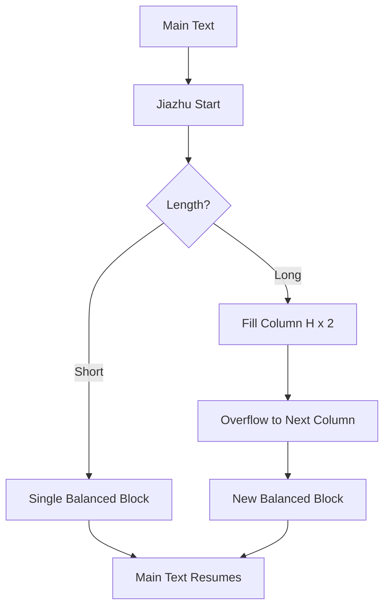

# Jiazhu (Interlinear Note) Requirement Document

## 1. Definition and Physical Constraints

Jiazhu (夹注, also known as 双行小注) is a sophisticated typesetting feature in traditional Chinese books where supplementary notes are inserted directly within the main text flow.

### 1.1 Spatial Logic
*   **Dual-Line Matching**: Jiazhu consists of two columns of smaller text that collectively occupy the width of a single main text column.
*   **Font Size**: Typically 50% of the main text font size.
    *   Example: Main text $18\text{pt} \rightarrow$ Jiazhu $9\text{pt}$.
*   **Vertical Advance**: Each character in the Jiazhu occupies the same vertical height as a main text character. This results in Jiazhu text appearing more sparsely distributed than main text if not adjusted, but ensures alignment with the grid.
*   **Zero Lateral Expansion**: Jiazhu is "embedded" in the main line. It must not require more width than the main text's column width.

## 2. Logical Constraints and Algorithms

### 2.1 Text Balancing (自动平衡)
A Jiazhu block must be evenly divided into two sub-columns (Right/Primary and Left/Secondary).

*   **Distribution Formula**:
    *   Let $L$ be the total character count.
    *   Right Column: $\lceil L/2 \rceil$ characters.
    *   Left Column: $L - \lceil L/2 \rceil$ characters.
*   **Odd Counts**: If $L$ is odd, the right column (which is read first) is longer by one character. The bottom of the left column remains empty.

### 2.2 Alignment and Flow
*   **Top Alignment**: The start of a Jiazhu block must align with the top of the main text line (if starting at the top).
*   **Height Wrapping**: Main text following a Jiazhu block must resume only after *both* Jiazhu columns have been completed. It follows the bottom of the longer column.

## 3. Breaking and Continuity Rules

The most complex part of Jiazhu is how it handles column and page breaks.

### 3.1 Case A: Non-Splitting (Short Notes)
If a note is short (e.g., ≤ 10 characters), it is typically treated as an atomic block. If it doesn't fit in the current column, the entire block moves to the next.

### 3.2 Case B: Continuous Break (Long Notes)
Long notes must flow across columns like main text.

*   **Column Fill**: Calculate the remaining vertical height $H$ in the current column.
*   **Truncation**: Extract $H \times 2$ characters from the Jiazhu stream.
*   **Filling**: Fill the remaining space in the current column with these characters using the dual-line balancing logic.
*   **Overflow**: The remaining characters continue at the top of the next column, starting a new dual-line balance process.

## 4. Input/Output and Technical Requirements

### 4.1 Input Specification
*   A sequence of main text nodes containing an embedded `NoteNode`.
*   Automatic detection of parent font size.

### 4.2 Output Specification
*   **Two-Column Internal Layout**:
    *   Right column (先行): Right-aligned.
    *   Left column (后行): Left-aligned.
    *   Inner Margin: A tiny gap standard for legibility between the two columns.
*   **Orphan/Widow Control**:
    *   **Prohibited**: A Jiazhu block cannot have ONLY its first line in the current column while the second line skips to the next. They must be broken in pairs.

## 5. Visual Representation Concept

