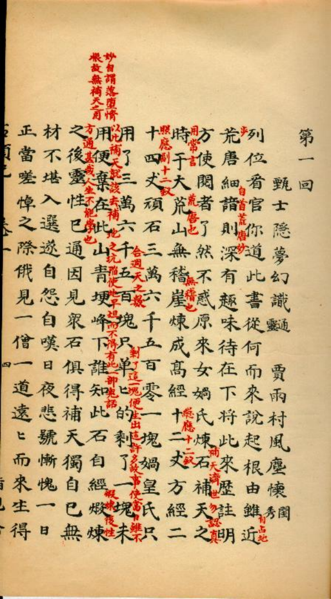
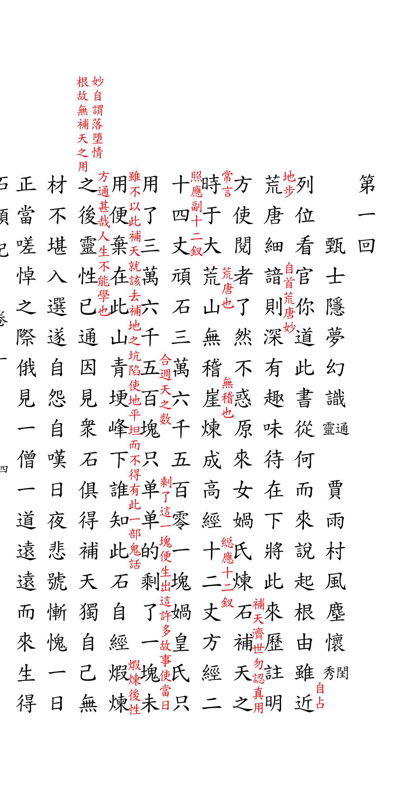
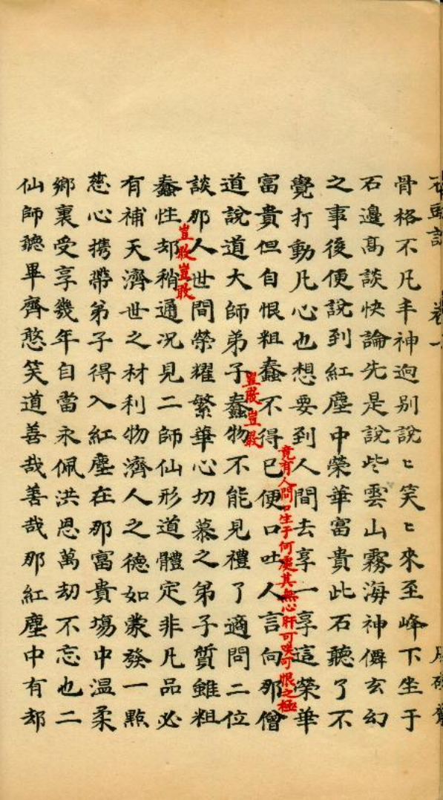
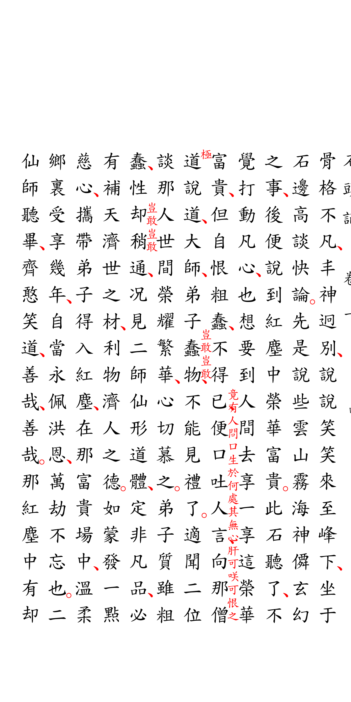

# 红楼梦甲戌本

本示例展示了 `luatex-cn` 宏包模拟手抄本、批改本风格的排版能力，特别侧重于侧旁注释系统的实现。

## 来源与背景
- **原件来源**：[Internet Archive - 脂砚斋重评石头记甲戌本](https://archive.org/details/1_20201215_20201215_1626/%E8%84%82%E7%A1%AF%E9%BD%8B%E9%87%8D%E8%A9%95%E7%9F%B3%E9%A0%AD%E8%A8%98%E7%94%B2%E6%88%8C%E6%9C%AC%EF%BC%88%E5%AD%98%E5%8D%81%E5%85%AD%E5%9B%9E%EF%BC%89/page/n15/mode/2up)
- **年代**：清代（脂砚斋评本）
- **参考资料**：[天一生水 - 红楼梦相关](https://dropbox.jiangyu.org/%E8%AF%BB%E4%B9%A6/%E7%BA%A2%E6%A5%BC%E6%A2%A6%E7%B3%BB%E5%88%97/%E7%BA%A2%E6%A5%BC%E6%A2%A6%E5%A4%A7%E8%A7%82%E5%9B%AD%E5%A4%8D%E5%8E%9F%E5%9C%B0%E5%9B%BE%E9%9B%86(%E9%AB%98%E6%B8%85).pdf)

## 底本与排版对照

| 底本书影 | luatex-cn 排版 |
|---|---|
|  |  |
| `ref-page1.png` — 卷一 第一回 首叶 | `page1.png` — `石头记.tex` → `石头记.pdf` 第 1 页 |
|  |  |
| `ref-page2.png` — 卷一 第一回 次叶 | `page2.png` — `石头记.pdf` 第 2 页 |

对照要点：正文黑字、脂批朱字，批语依附于所评之字的右侧或上方；
「补天济世勿认真用」一类双行小字批以双列排出；全叶无乌丝栏，
版心只留题名与页码。排版复刻的是版式与批语位置，不摹写手书笔迹，
故字形取行楷字体近似之，纸色、墨渍、虫蛀等原件痕迹不作模拟。

> `ref-*.png` 是底本扫描件，不是排版产物；
> `scripts/build/build_examples.py` 不会重写它们。

## 排版特点
- **侧批与眉批**：利用宏包内置的 `sidenote` 系统，实现了在正文边缘（侧边或上方）添加评论的功能，这是评点本的核心特征。
- **双列小字**：演示了在同一行水平宽度内排列两列小号文字的排版方式（用于正文注释）。
- **无乌丝栏**：模拟手绘/手描的灵活版式，无需固定网格约束。
- **版心设计**：版心仅显示文字，不带鱼尾装饰。
- **页码排版**：页码放置在版面底部，而非版心侧边。
- **行楷字体**：匹配手写手抄的视觉风格。

## 我们做了什么
1.  **侧边栏注释系统**：重点实现了 `sidenote` 模块，并调整了其与正文的相对位置。
2.  **动态行高**：处理了由于双列小字带来的局部行高变化。
3.  **灵活版式支持**：通过取消网格强制对齐，模拟了手稿的自由感。