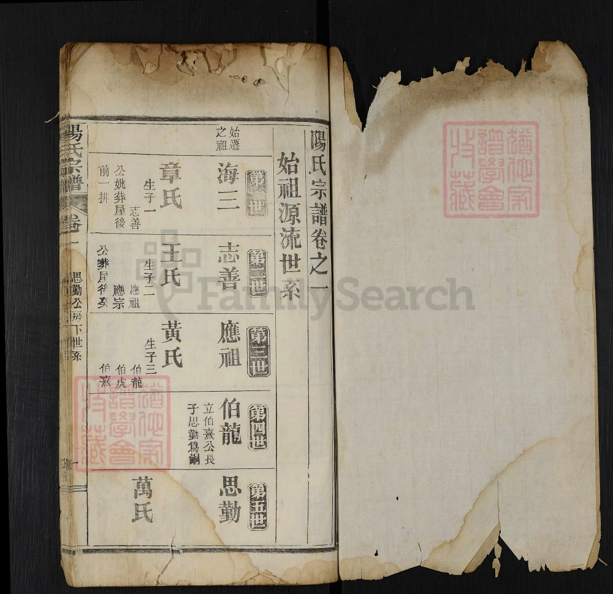
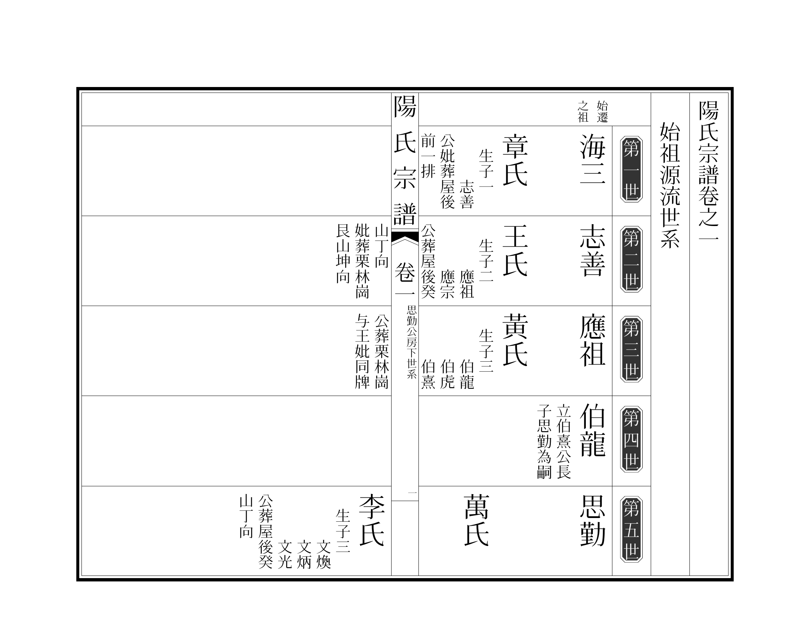

# 欧式族谱

本示例复刻《陽氏宗譜》卷之一「始祖源流世系」的欧式（苏式）谱表版式：
以世次横栏分格，每格内右为讳名、左为配氏与葬向小注。

## 底本与排版对照

| 底本书影 | luatex-cn 排版 |
|---|---|
|  |  |
| `ref-p1.png` — 卷之一首开（第一至五世） | `p1.png` — `族谱.tex` → `族谱.pdf` 第 1 页 |

排版只复刻底本首开印面（第一至五世）的世系格架，未摹写纸色、破损与藏书印。

## 其余底本书影（仅供参考，未排版）

| 文件 | 内容 |
|---|---|
| `ref-p2.png` | 思勤公房下世系，第六至十世 |
| `ref-p3.png` | 卷之三 思恕公次房下世系，第六至十世 |
| `ref-p4.png` | 思恕公次房下世系，第十一至十七世 |

## 排版特点
- **世次格栏**：用横栏切分世代，栏首以黑底反白的「第N世」标签标记。
- **名下小注**：讳名之下接排配氏、生子、葬向等小字注文。
- **书口题名**：中缝题「陽氏宗譜　卷一」与房支名。

## 来源
- 书影来源：<https://www.lulugu.com/ouyang/19419.html>（图内水印为 FamilySearch）

> `ref-*.png` 是底本扫描件，不是排版产物；
> `scripts/build/build_examples.py` 不会重写它们。
