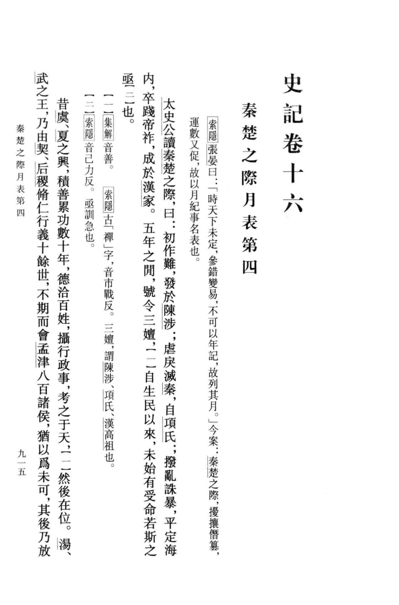
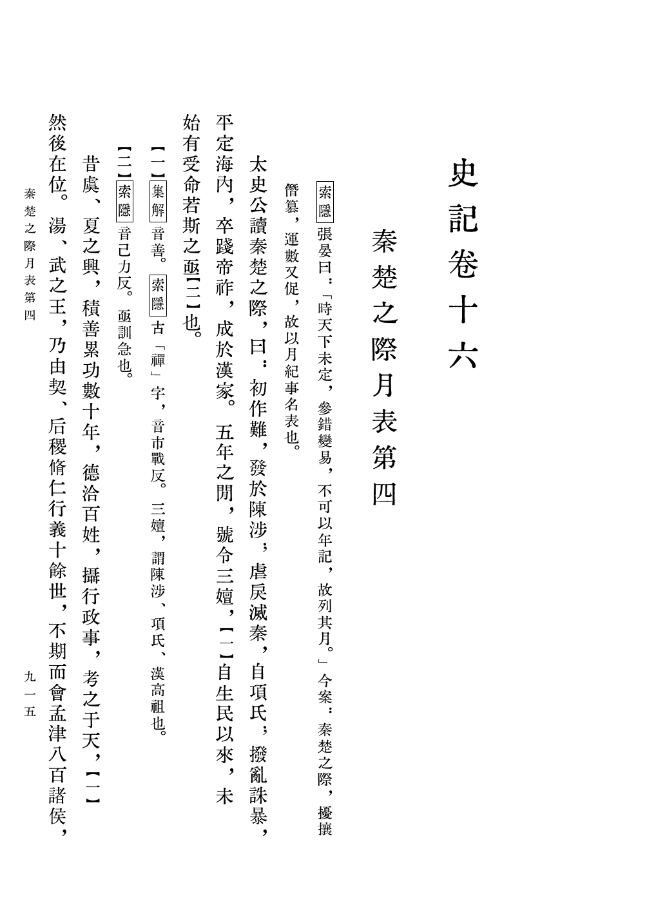
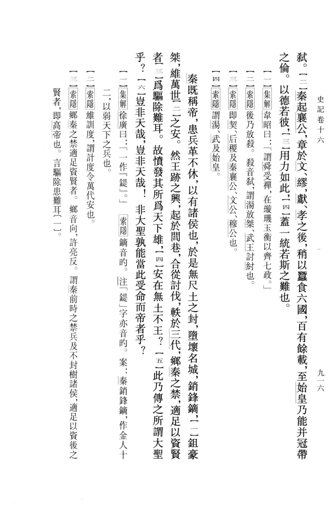
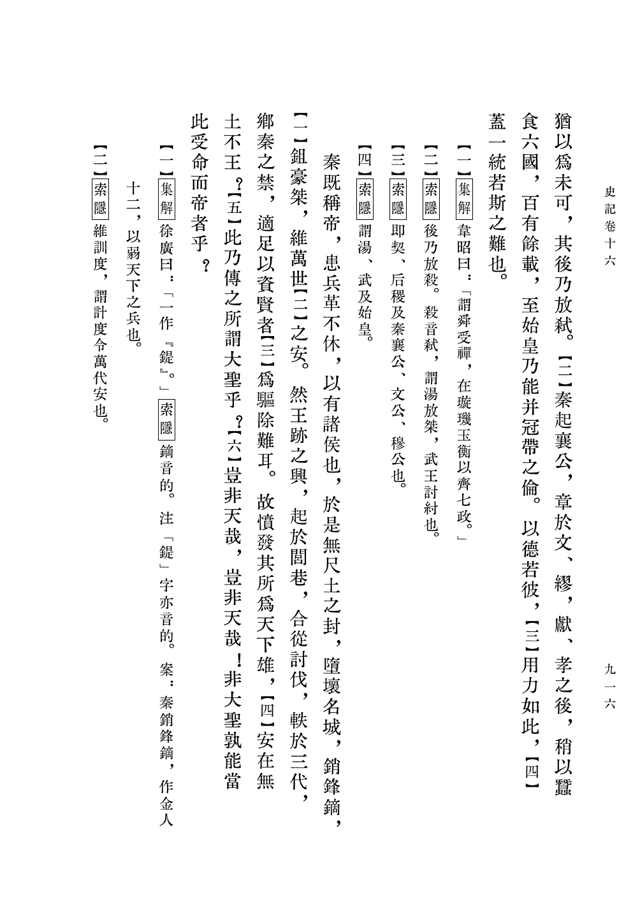
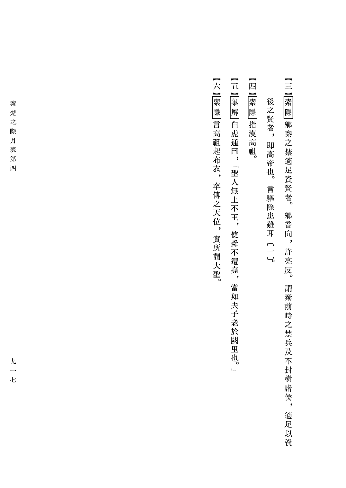

# 现代竖排书

本示例展示了 `luatex-cn` 宏包在现代书籍排版场景下的应用，侧重于简洁的垂直布局而非传统古籍元素。

## 来源与背景
- **设计初衷**：演示宏包对现代学术竖排（点校本）版式的支持。
- **内容**：《史记》卷十六〈秦楚之際月表第四〉序，含集解、索隐两家注。
- **底本**：中华书局点校本《史记》第 915–917 页。

## 底本与排版对照

| 底本书影 | luatex-cn 排版 |
|---|---|
|  |  |
| `ref-page-004.png` — 底本第 915 页 | `page-1.png` — `卷十六.tex` → `卷十六.pdf` 第 1 页 |
|  |  |
| `ref-page-005.png` — 底本第 916 页 | `page-2.png` — `卷十六.pdf` 第 2 页 |
| （无扫描件） |  `page-3.png` — 底本第 917 页的注文余文 |

对照要点：正文之后接排注文，注家名（集解／索隐）加方框，注码作【一】【二】，
人名、朝代名加专名线，版心只留篇题与页码，页码沿用底本的九一五／九一六／九一七。
行款为宏包自动排布，不逐行摹写底本断行，故换页处与底本略有前后
（底本第 915 页末为「其後乃放」，此处断在「猶以爲未可，其」）。

> `ref-*.png` 是底本扫描件，不是排版产物；
> `scripts/build/build_examples.py` 不会重写它们。

## 排版特点
- **无网格/无鱼尾**：移除了传统的乌丝栏和鱼尾装饰，保持页面清新。
- **现代标点适配**：演示了在垂直排版中，现代标点符号（如逗号、句号）的正确旋转与定位。
- **标准的垂直排版**：展示了最基础但最稳健的竖排逻辑，适用于现代文学作品。

## 我们做了什么
1.  **极简配置**：通过禁用古籍特有模块（如 `banxin` 中的鱼尾），实现了现代感的版式。
2.  **字体支持**：使用项目 manifest 内的免费字体京華老宋体（KingHwa_OldSong），
    通过 `python3 scripts/download_fonts.py --all --user` 获取后即可按文件名引用，
    保证任何人都能复现编译。
3.  **排版测试**：验证了在长段落和多页场景下，现代文本的流动与分页效果。
