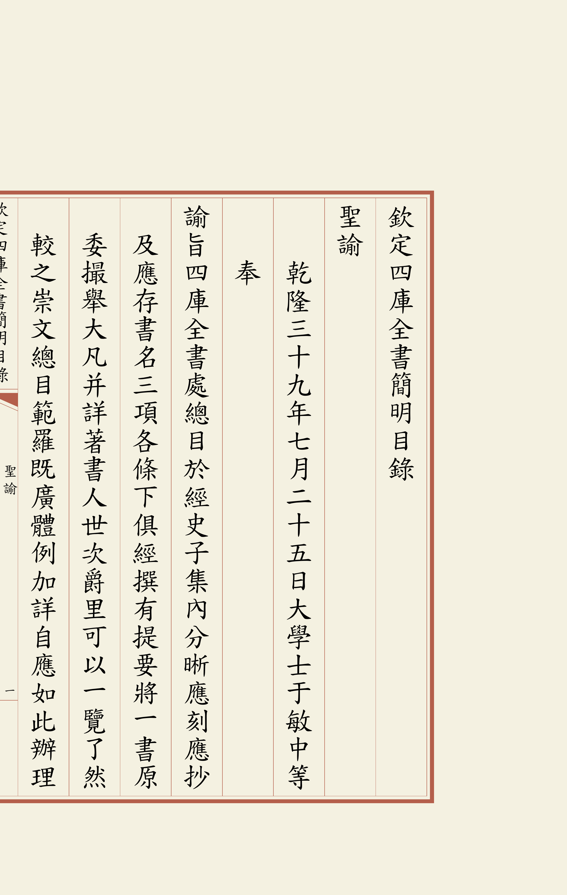
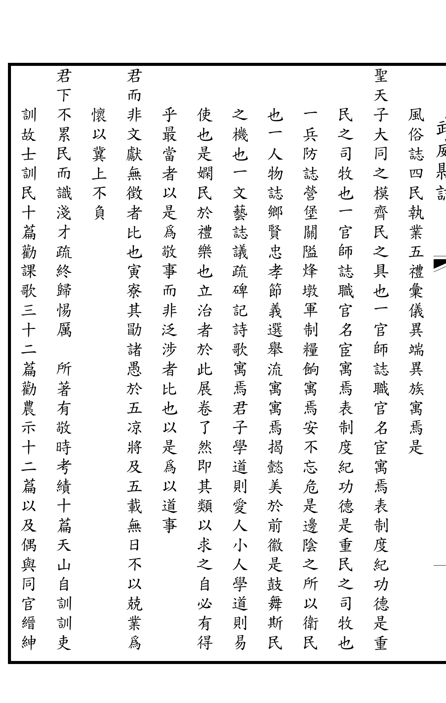
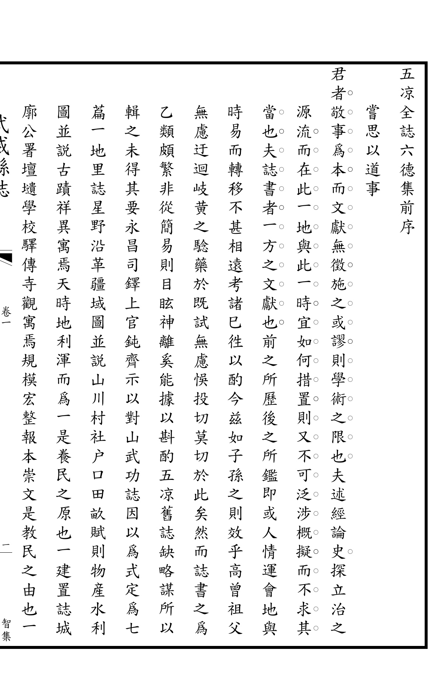

# 模板

收集个性化的不同模板配置。每个模板包含：配置文件（.cfg）、示例 TeX 源码、PDF 预览和 PNG 截图。

---

## 四库全书文渊阁本

八行二十一字的经典古籍版式，黄色封面、"文渊阁宝"印章、淡黄纸张背景、红色边框。

📁 [查看模板](四库全书文渊阁本/)

| 第二页 | 第一页 |
|:---:|:---:|
|  |  |

---

## 五凉全誌六德集

无栏线、粗外框的简约版式，适合地方志类古籍。12栏30字，22pt 字号。

📁 [查看模板](五凉全誌六德集/)

| 第二页 | 第一页 |
|:---:|:---:|
|  |  |