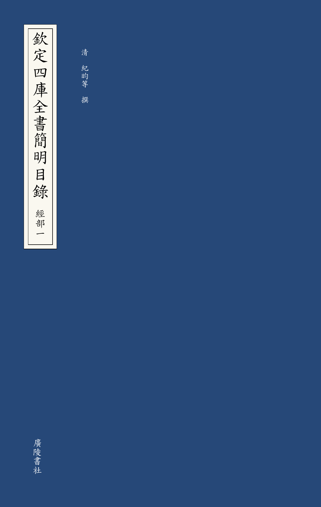
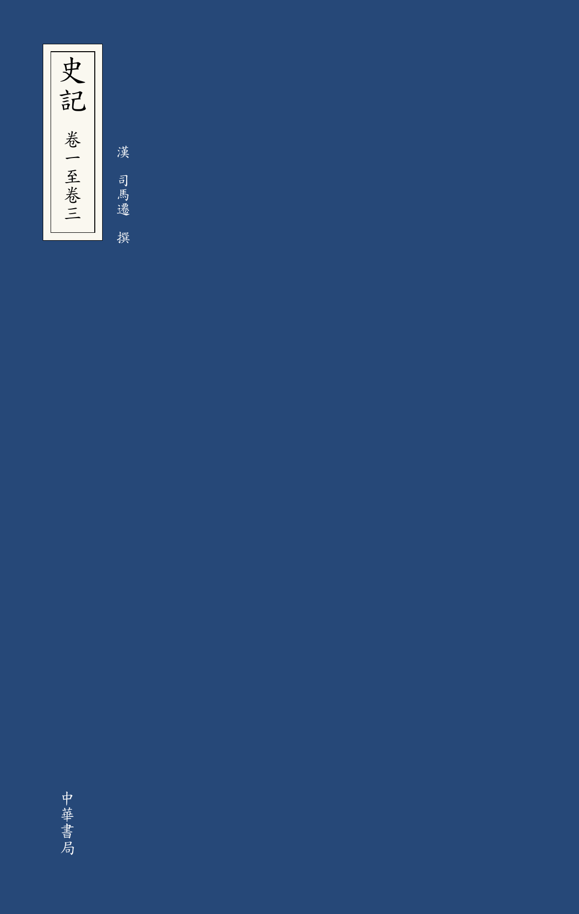
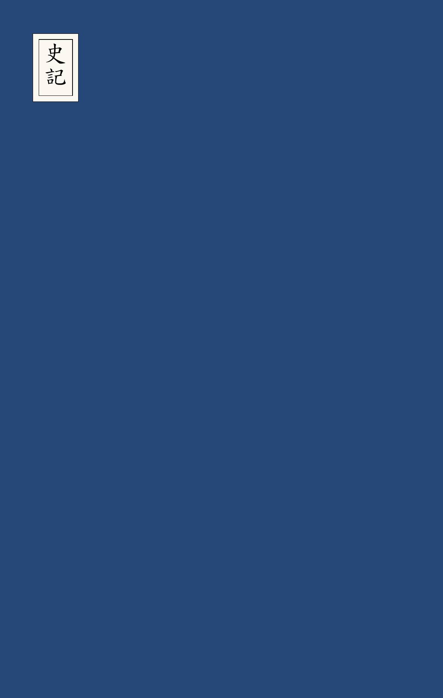

# 线装书封面

现代蓝色线装书封面（中华书局、广陵书社等常见样式），issue [#170](https://github.com/open-guji/luatex-cn/issues/170)。
参照 CY/T 247—2021《线装书籍要求》。

| 三、长书名（签自动增高） | 二、副题 + 作者 + 出版者 | 一、只给书名 |
|:---:|:---:|:---:|
|  |  |  |

源码：[封面.tex](封面.tex)　PDF：[封面.pdf](封面.pdf)

## 用法

`ltc-guji` 文档类内置，无需额外载入：

```latex
\线装书封面{史記}

\线装书封面[
  副题 = 卷一至卷三,
  作者 = 漢　司馬遷　撰,
  出版者 = 中華書局,
]{史記}
```

`\线装书封面` 自己生成一整页（内部就是 `\begin{封面}...\end{封面}`），页面尺寸沿用文档当前设置。
书名签高度 = 书名字数 × 书名字号 +（副题时）半字间隔 + 副题字数 × 副题字号 + 上下留白，随字数自动增高。

### 键值

所有位置都按「距页面**左边**／**上边**」计（书签贴在封面左上角）。

| 键（简／英） | 默认 | 说明 |
|---|---|---|
| `底色` / `background-color` | `38, 72, 120` | 封面底色（藏青蓝，RGB 0–255 或颜色名） |
| `副题` / `subtitle` | 空 | 签内书名下的小字（卷次、册次等） |
| `书名字号` / `title-font-size` | 30pt | |
| `副题字号` / `subtitle-font-size` | 18pt | |
| `签左距` / `label-left` | 15mm | 书名签左缘距页面左边 |
| `签上距` / `label-top` | 15mm | 书名签上缘距页面上边 |
| `签留白` / `label-padding` | 7pt | 签内框与外缘细线之间的留白 |
| `签底色` / `label-background-color` | `250, 248, 240` | 书签纸色 |
| `签字色` / `label-color` | `0, 0, 0` | 书名与签框线颜色 |
| `作者` / `author` | 空 | 作者小字 |
| `作者字号` / `author-font-size` | 14pt | |
| `作者左距`、`作者上距` / `author-left`、`author-top` | 紧贴书签右侧、底端与签底平齐 | 手动指定位置 |
| `出版者` / `publisher` | 空 | 出版者小字 |
| `出版者字号` / `publisher-font-size` | 16pt | |
| `出版者左距` / `publisher-left` | 20mm | |
| `出版者上距` / `publisher-top` | 底端距页面下边 20mm | |
| `小字颜色` / `text-color` | `255, 255, 255` | 作者、出版者颜色 |

### 更多小字：`\封面文字`

需要其他位置的文字时，直接用 `\begin{封面}` 加 `\封面文字`（`\CoverText`）：

```latex
\begin{封面}[底色={38, 72, 120}]
  \封面文字[左距=30mm, 上距=40mm, 字号=20pt]{任意竖排文字}
\end{封面}
```

`\封面文字` 键：`左距`/`left`、`上距`/`top`、`字号`/`font-size`、`颜色`/`color`（默认白色）。

## 取值说明

- 标准原文与实物图在本仓编写时未能取得，尺寸、颜色按常见实物估计；如需精确对标，请调整上述键值。
- 书签用**一个**悬浮文本框实现（底色 + 内框 + 外缘细线）。悬浮框之间的绘制次序不固定，小字请勿与书签重叠。
