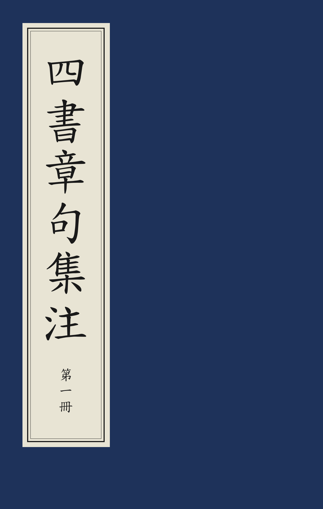

# 线装书封面

现代蓝色线装书封面（中华书局、广陵书社等影印古籍常见样式），issue [#170](https://github.com/open-guji/luatex-cn/issues/170)。
参照 CY/T 247—2021《线装书籍要求》图 1、图 2。

| 四、小字随书名 | 三、长书名 + 册次卷次 | 二、卷次 | 一、短书名 + 册次 |
|:---:|:---:|:---:|:---:|
|  |  |  |  |

源码：[封面.tex](封面.tex)　PDF：[封面.pdf](封面.pdf)

## 版式

- 藏青色封面，封面上只有签条（不印作者、出版者）。
- 签条贴在左上角，米色纸；内为「文武线」双框（外粗内细），框外留一圈纸边。
- 书名大字自上而下。签条有最小高度（默认页高的 55%），书名长了签条随之增高；
  若增高后超出页面，书名与小字按比例缩小。
- 册次、卷次小字排在签条下部；两者都给时并排两列（册次在右、卷次在左）。
  也可 `小字位置=随后`，紧跟在书名之后。

## 用法

`ltc-guji` 文档类内置，`\线装书封面` 自成一页（内部即 `\begin{封面}`），页面尺寸沿用文档设置：

```latex
\线装书封面[册次=第一冊]{史記}
\线装书封面[卷次=卷一]{李白詩集}
\线装书封面[册次=第九冊, 卷次=卷二十一至二十三]{欽定四庫全書簡明目錄}
\线装书封面[册次=第一冊, 小字位置=随后]{四書章句集注}
```

### 键值

长度类键不给（或给 `0pt`）时按页面比例自动取值。

| 键（简／英） | 默认 | 说明 |
|---|---|---|
| `册次` / `volume` | 空 | 如「第一冊」 |
| `卷次` / `juan` | 空 | 如「卷一」「卷二十一至二十三」 |
| `小字位置` / `small-position` | `底部`（bottom） | `随后`（follow）：紧随书名 |
| `底色` / `background-color` | `30, 50, 90` | 封面色（RGB 0–255 或颜色名） |
| `签条底色` / `label-color` | `232, 228, 212` | 签条纸色 |
| `墨色` / `ink-color` | `25, 25, 25` | 书名、小字、框线颜色 |
| `签条宽` / `label-width` | 页宽 × 0.27 | |
| `签条左距` / `label-left` | 页宽 × 0.07 | 签条左缘距页面左边 |
| `签条上距` / `label-top` | 页高 × 0.045 | 签条上缘距页面上边 |
| `签条最小高` / `label-min-height` | 页高 × 0.55 | |
| `书名字号` / `title-font-size` | 签条宽 × 0.55 | |
| `小字字号` / `small-font-size` | 书名字号 × 0.3 | |

文武线粗细、两线间距、纸边宽度均按签条宽比例取（外粗线 1.3%、内细线 0.4%、间距 2.5%、纸边 5.5%）。

## 取值说明

颜色取自 issue 所附标准图与实物照片的取样；比例按标准图 1、图 2 与实物照片量取。
